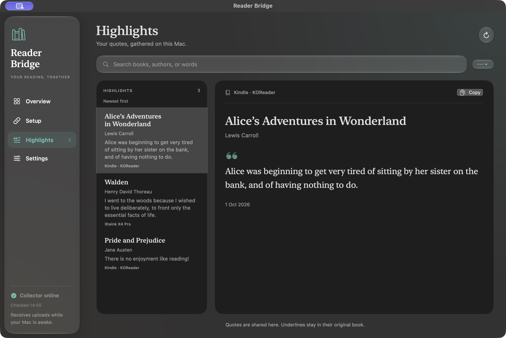

# Reader Bridge: Kindle and Xteink highlight sync

Collect highlights from **KOReader on a Kindle** and **CrossPoint on an Xteink X4 Pro** in one personal archive. Set up reading-progress sync between the readers, import existing Kindle highlights, and optionally serve the same EPUB books to both devices from your Mac.

Reader Bridge is an open-source macOS setup wizard for this workflow. It brings together the reader plugins, custom CrossPoint firmware, local highlight collector, and device instructions. **Shared highlights means one quote collection; it does not copy highlight underlines into the book on the other reader.**

[Setup guide](docs/SETUP.md) · [Download the release](https://github.com/skyerus/reader-bridge/releases/latest) · [Common questions](#common-questions) · [Compatibility](#compatibility)

**Native Mac app in development:** Reader Bridge includes a SwiftUI app with guided device pairing and a searchable local highlight archive. **iCloud Drive is the recommended backup option on Mac**; another folder or optional GitHub backup also works. The build bundles Python, so basic setup needs no Terminal, Python installation or GitHub account. See [build and use the Mac app](docs/MAC-APP.md). The existing v0.1.0 release is the command-line setup; a notarized public app installer is not available yet.



The Mac app offers one-step-at-a-time setup, visual device guides, and a local archive. [See setup screenshots and instructions](docs/MAC-APP.md).

## The problem: switching readers without leaving your reading history behind

You have a Kindle, a collection of highlighted passages, and a new Xteink X4 Pro. You want to read on whichever device suits the moment, pick up at the same passage, and keep the quotes you save in one place.

Getting there takes several separate pieces: a supported Kindle jailbreak, KOReader, CrossPoint, a shared reading-progress account, a way to collect highlights from both readers, and identical book files. Each piece has its own installation, credentials, menus, and restart steps. An existing Amazon highlight collection also needs an import path.

Reader Bridge packages that setup into a guided, resumable workflow. The wizard installs and pairs the components it can control, preserves queued highlights and credentials when rerun, and gives you the on-device steps for the parts that need a tap, eject, or restart. The Mac services start after login, so you do not need to keep a Terminal window open.

## What Reader Bridge does

| What you want | How it works |
| --- | --- |
| Keep Kindle and Xteink highlights together | KOReader highlights and CrossPoint clippings upload automatically to a local collector. Add iCloud Drive, a backup folder or GitHub for another copy. Offline changes wait for a connection. |
| Continue reading on the other device | Uses the existing KOReader-compatible CrossPoint Sync service. KOReader can sync automatically; Xteink uses manual **Upload Local** and **Apply Remote** actions. |
| Bring your existing Kindle highlights | Imports English-format `My Clippings.txt` exports, including original creation dates, without needing an Amazon login in Reader Bridge. |
| Highlight across pages on the X4 Pro | Custom CrossPoint firmware keeps a selection active when you drag to a page edge, within the current chapter. |
| Download the same EPUB to both readers | Optional Calibre-Web setup provides a local OPDS book catalog, preserving the downloaded EPUB bytes needed for binary progress matching. |
| Run it from your Mac | A local collector and optional library run after login. Your Mac needs to be awake and reachable for those services; downloaded books remain readable offline. |

Progress sync is an existing KOReader/CrossPoint capability. Reader Bridge adds the setup workflow, shared-highlight collection, KOReader plugin, and custom CrossPoint highlighting and upload behavior. It does not replace Amazon's stock reader or automatically migrate DRM-protected books.

## Prerequisite: jailbreak your Kindle and install KOReader

**Your Kindle must already be jailbroken and able to open books in KOReader before setting up Reader Bridge.** Reader Bridge does not jailbreak your Kindle.

1. Read the [KindleModding jailbreak guide](https://kindlemodding.org/jailbreaking/), then use [Find My Jailbreak](https://kindlemodding.org/kindle-models) to check your exact Kindle model and firmware version.
2. Follow the method the wizard recommends, including its post-jailbreak steps. If no supported method is available for your device, stop here.
3. Follow the [official KOReader installation instructions for Kindle](https://github.com/koreader/koreader/wiki/Installation-on-Kindle-devices). Open an EPUB in KOReader to confirm it works, then return here.

Already reading in KOReader? Continue below. Our [Kindle setup checklist](docs/SETUP.md#1-get-koreader-working-on-the-kindle) adds the device checkpoints for this workflow.

## Quick start on macOS

Start the guided setup:

```sh
git clone https://github.com/skyerus/reader-bridge.git
cd reader-bridge
python3 setup.py
```

You need macOS, Python 3.10+, Git, and [GitHub CLI](https://cli.github.com/) signed in with `gh auth login`. The wizard asks before creating your own **private** highlight archive. It never chooses the developer's archive.

[Follow the complete device and setup guide](docs/SETUP.md). Software tests and a firmware build do not replace the guide's physical-device checkpoints.

## Compatibility

| Component | Integration reference |
| --- | --- |
| Mac | macOS; Python 3.10 or newer; authenticated GitHub CLI |
| Kindle | Paperwhite 5, firmware 5.19.2, already jailbroken, KOReader kindlehf build based on v2026.07.2 |
| Xteink | X4 Pro, pinned custom CrossPoint 1.6.5 source |

This device pair was used for integration testing. Other Kindle models require their own supported jailbreak and KOReader path. The wizard's full fresh-Mac/device walkthrough still needs the physical acceptance checkpoints in the guide; compilation and automated tests do not establish compatibility with every device.

## Preview, resume and diagnose

```sh
python3 setup.py --dry-run
python3 setup.py --help
python3 setup.py doctor
python3 setup.py status
```

Run the wizard again to resume skipped steps. Each component also has a subcommand; use `python3 setup.py COMMAND --help`. The wizard never erases books, factory-resets readers, or flashes a Kindle.

Reader Bridge keeps local data under `~/Library/Application Support/Reader Bridge`. The collector and optional library use ports 8084 and 8083; occupied ports are checked. Its own LaunchAgents are `com.readerbridge.collector` and `com.readerbridge.library`. An asleep Mac cannot receive uploads; devices retain their queues.

```sh
python3 setup.py uninstall
```

This removes only owned background services. Archives, local inboxes, backups, library books and device installations remain available.

## Import existing Kindle highlights

KOReader's plugin imports modern annotations from books still in reading history. Open older annotated books once to let KOReader migrate their sidecars. You can also import an English Kindle export:

```sh
python3 setup.py --dry-run import-clippings "/path/to/My Clippings.txt"
python3 setup.py import-clippings "/path/to/My Clippings.txt"
```

Notes and bookmarks are excluded. Unsupported languages are skipped rather than guessed; the source export is never changed. Quotes are first acknowledged locally; `status` reports whether GitHub publication is still pending.

## Common questions

### Can I sync Kindle highlights with an Xteink X4 Pro?

Yes, when you read in KOReader on the Kindle and use the custom CrossPoint firmware on the X4 Pro. Both send saved passages to the same personal archive. Existing Amazon Kindle highlights can be imported from an English `My Clippings.txt` export. Highlights made later in Amazon's stock Kindle reader are not automatically captured by the KOReader plugin; import an updated export to add them.

### Can KOReader and CrossPoint sync reading progress?

Yes. Configure the same KOReader-compatible sync server and account, then use the exact same EPUB file on both readers. KOReader supports automatic progress sync. On Xteink, use **Upload Local** before switching away and **Apply Remote** when returning. The [progress setup instructions](docs/SETUP.md#6-connect-reading-progress) include a test in both directions.

### Does this use Amazon Whispersync?

No. Reading progress uses a KOReader-compatible service, separately from Amazon Whispersync. Highlights use the Mac collector and your archive. This workflow reads books with KOReader on Kindle and CrossPoint on Xteink; it does not sync reading positions with Amazon's stock Kindle reader or Kindle mobile app.

### Do highlights appear inside the book on both devices?

No. The shared archive contains the passages you saved on either reader. Each reader keeps its own in-book annotations. Cross-device underline placement is not implemented.

### Do I need a hosted server or a Readwise account?

You can run the highlight collector and optional EPUB library on your Mac without renting a server. Reader Bridge does not require Readwise or GitHub for the Mac app. Choose iCloud Drive or another folder for automatic snapshots; GitHub remains optional. Reading progress uses the separate CrossPoint Sync service by default. The Mac-hosted services are unavailable while the Mac is asleep or shut down.

### Can one script jailbreak my Kindle and install everything?

The wizard automates Mac setup, plugin pairing, and building and transferring the custom X4 Pro firmware. Kindle jailbreaking and initial KOReader installation still follow the current upstream instructions for your exact model and firmware. Firmware installation also needs confirmation on the Xteink itself. Follow the [full setup guide](docs/SETUP.md) for these checkpoints.

### Can I read my Amazon purchases in this setup?

KOReader and CrossPoint need supported, DRM-free book files for this EPUB workflow. Reader Bridge does not download Amazon purchases, remove DRM, or include books. Importing old Kindle highlights transfers the exported quote text, not the purchased ebook.

## Privacy and limits

### Wi-Fi and battery

Automatic highlights do not require an always-on Wi-Fi connection. Xteink connects to a saved network only when uploads are waiting, and switches the radio off afterwards if the sync task enabled it. An already-connected radio remains under its existing owner's control. Failed attempts back off from one minute to fifteen minutes; sleeping readers are not woken to upload. The KOReader plugin only uses an already-connected network and stops its work on suspend.

Uploads, retries and awake queue checks still consume some energy. Long-duration battery drain has not been measured; this is not a zero-overhead claim. Reading-progress sync and other network features have their own Wi-Fi settings.

### Data and scope

Use a trusted home LAN. Device highlight HTTP requests carry a dedicated bearer token without transport encryption. Do not forward these ports through your router or publish pairing files, queue files, backups, books or account exports.

The shared archive collects excerpts; it does not synchronize underlines between rendering engines. Deleting a quote suppresses the matching normalized title, author and passage. Snapshot restore preserves current deletions and edits. Earlier snapshots and Git history can still contain deleted text; deletion does not rewrite them or remove annotations from the other device.

Custom firmware is built from the source revision in [firmware.json](firmware.json), with PlatformIO 6.2.0 and SdFat 2.3.1. This project does not redistribute prebuilt firmware, jailbreak bundles, DRM tools or books. First builds require internet access and may take several minutes. [Upstream sources and packaging notes](docs/UPSTREAM-SOURCES.md).

## Development

```sh
python3 -m unittest discover -s tests -v
for test in koreader/sharedhighlights.koplugin/tests/*_test.lua; do lua5.1 "$test"; done
```

Tests use temporary files and mocked external commands; collector HTTP tests bind localhost. They never install live services, create a GitHub repository or modify a device. Reader Bridge's original code is MIT licensed; external applications retain their own licenses.
