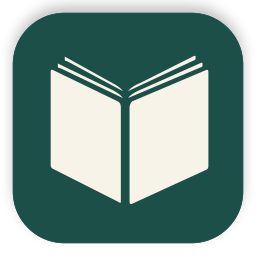
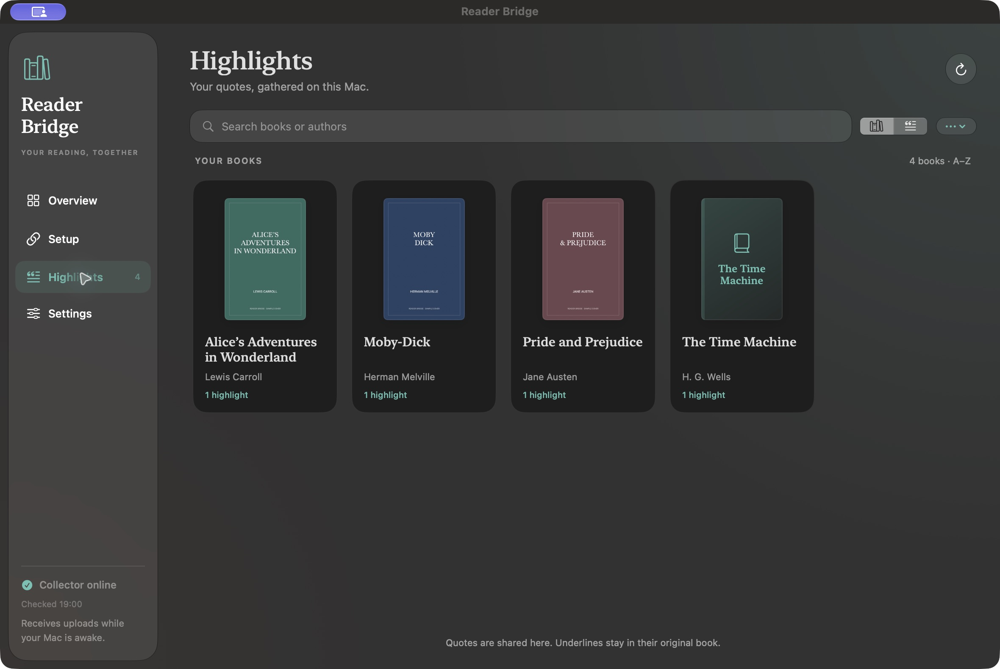

# Passage



Keep the passages you highlight in one place, whether you read on a Kindle with KOReader, a CrossPoint reader, or both. Passage is a native Mac app with guided reader setup, a searchable book library, and optional iCloud Drive or folder backups.

Formerly Reader Bridge. Existing archives and reader connections keep their identities.

[Get started](docs/MAC-APP.md) · [Releases](https://github.com/skyerus/reader-bridge/releases) · [Reading positions](docs/PROGRESS-SYNC.md)

**Downloads:** use [Releases](https://github.com/skyerus/reader-bridge/releases) for installer availability. A release marked **Pre-release** is a test candidate; its notes list the available Mac architecture and remaining acceptance checks. The older v0.1.0 release contains command-line source only. [Release requirements](docs/RELEASING.md).



## What you can do

- Collect highlights from one reader or several, including their recorded dates and embedded book covers.
- Search, copy, import an existing Kindle `My Clippings.txt`, and export a portable archive.
- Back up automatically to iCloud Drive or another folder. A GitHub account is optional.
- Continue at the same passage on another reader with the app's optional reading-position service and identical EPUB files. CrossPoint uses **Upload Local** and **Apply Remote**.

Your quotes stay on your Mac. The app's collector starts after login and continues when you close the window. The Mac must be awake and reachable for uploads; readers retain their offline queues.

Shared highlights are a quote collection. Each reader retains its own in-book underlines. Amazon's stock Kindle reader and Whispersync are separate: use KOReader for automatic Kindle capture, or import an updated Clippings export for stock-reader highlights.

## Before connecting a reader

**Kindle:** it must have a supported jailbreak and working KOReader. Read [KindleModding's introduction](https://kindlemodding.org/jailbreaking/), check your exact model and firmware with [Find My Jailbreak](https://kindlemodding.org/jailbreak-wizard.html), and follow the [official KOReader Kindle installation guide](https://github.com/koreader/koreader/wiki/Installation-on-Kindle-devices). Complete the guide's post-jailbreak steps and open an EPUB in KOReader before pairing. Passage does not jailbreak or downgrade a Kindle. If the wizard has no supported method for yours, you can still import an existing Clippings file.

**CrossPoint reader:** install CrossPoint for your exact model using its [official site](https://crosspointreader.com/) and [device picker](https://updates.crosspointreader.com/). Passage then needs its matching custom firmware to collect highlights. Setup lists the supported models and whether a verified image is included. An upstream CrossPoint installation alone does not provide Passage's uploader. Preserve your books and hidden `.crosspoint` folder when updating.

Use your Mac and readers on the same trusted home network, with DRM-free books you can read on the selected devices. A second reader is optional.

## Install the Mac app

When a release includes a Passage disk image:

1. Download the `.dmg` for your Mac: **arm64** for Apple Silicon, **x86_64** for Intel. Check that release's accepted macOS versions and reader models.
2. Open it, drag **Passage** into **Applications**, and eject the disk image.
3. Open Passage from Applications, choose the reader or readers you use, and follow Setup. Basic highlight setup uses the app's bundled runtime and firmware; it needs no Terminal, Python, Git, compiler, or GitHub account.
4. Save one highlight with the reader connected to Wi-Fi and check it appears in Passage.

[First-install walkthrough, backups, upgrades, and troubleshooting](docs/MAC-APP.md).

## Compatibility and privacy

The app targets macOS 13 or later; architecture and physical acceptance are recorded per release. Source builds and a successful automated test do not establish a clean-Mac or physical-reader pass. The previous integration reference used a Kindle Paperwhite 5 with KOReader and an Xteink X4 Pro. Other profiles need their own physical acceptance before release notes claim support.

Passage preserves settings, reader identities, queued highlights, and archive formats across upgrades. Local data remains in `~/Library/Application Support/Reader Bridge`; see the [upgrade instructions](docs/MAC-APP.md#upgrading-reader-bridge) before changing an existing app's location.

Highlight connections use a private LAN address and a dedicated bearer token over HTTP. Keep them on a trusted network; do not forward service ports through your router. Pairing files and backups are private. [Security policy](SECURITY.md).

## Development

[Build and release the app](docs/RELEASING.md) · [Advanced command-line setup](docs/SETUP.md) · [Validation history](docs/VALIDATION.md) · [Upstream sources and notices](docs/UPSTREAM-SOURCES.md)

```sh
python3 -m unittest discover -s tests -v
swift test --package-path desktop
python3 scripts/build-macos.py --dmg
```

Development disk images are labeled `-development` and are signed ad hoc by default. Consumer releases require Developer ID Application signing, accepted notarization, stapled tickets, Gatekeeper verification, and a separate clean-Mac and physical-reader acceptance report. Firmware packages include pinned application images, corresponding source, and dependency notices. No jailbreak tools, KOReader itself, books, fonts, or dictionaries are bundled.
