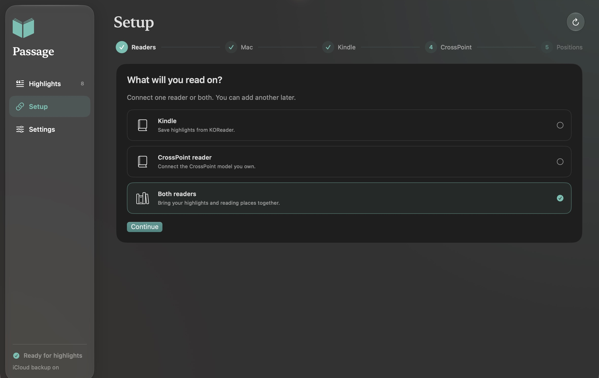
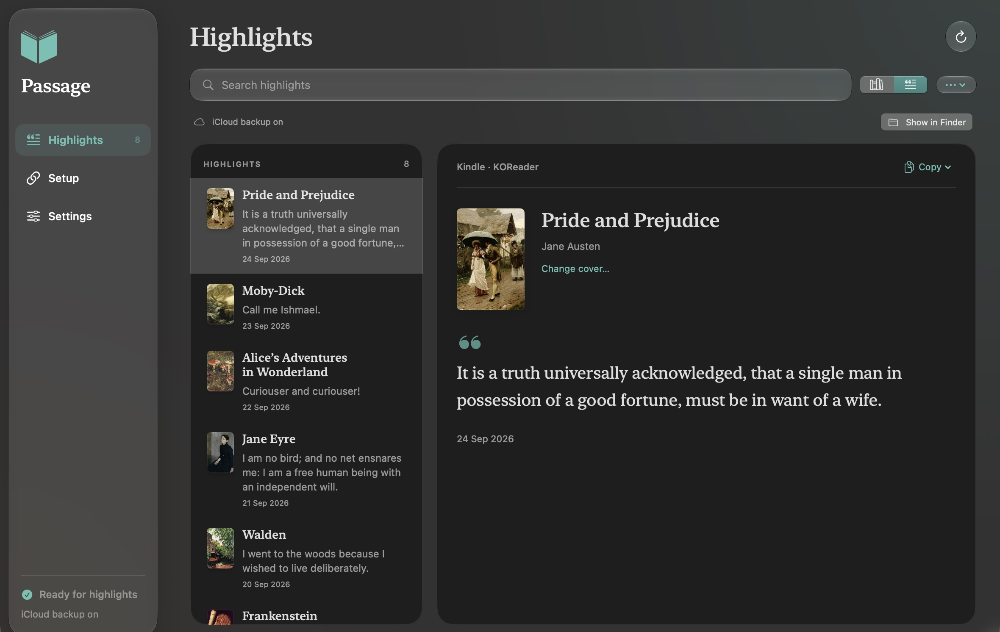

# Passage for Mac

Passage collects your reading highlights in a searchable local library. Use a Kindle with KOReader, a supported CrossPoint reader, or both. Backups and reading-position sync are optional.

Download [Passage 0.7.0 release candidate 3 for Apple Silicon](https://github.com/skyerus/reader-bridge/releases/download/v0.7.0-rc.3/Passage-0.7.0-arm64.dmg). The app and disk image are Developer ID signed and notarized. This **pre-release** still needs a separate clean-Mac walkthrough and physical-reader acceptance of the exact installer. [Release notes, checksums, and candidate evidence](https://github.com/skyerus/reader-bridge/releases/tag/v0.7.0-rc.3).

## Before you start

You need an Apple Silicon Mac (M1 or later) running macOS 13 or later. Automatic reader capture also needs a charging/data cable, the Mac and reader on the same trusted home Wi-Fi, and a DRM-free EPUB. Importing a highlights file needs only the Mac. Basic app setup does not require developer tools or a GitHub account. Intel Macs have a source-build path; there is no consumer installer for Intel, Windows, or Linux.

For a Kindle, first complete a supported jailbreak and install KOReader. Follow the [KindleModding introduction](https://kindlemodding.org/jailbreaking/), [exact model and firmware picker](https://kindlemodding.org/jailbreak-wizard.html), and [KOReader Kindle installation guide](https://github.com/koreader/koreader/wiki/Installation-on-Kindle-devices). Complete the method's post-jailbreak steps. Open your EPUB in KOReader before returning to Passage. If no method supports your Kindle, stop the pairing path; existing `My Clippings.txt` imports remain available.

For a CrossPoint reader, follow its [official installation guide](https://github.com/crosspoint-reader/crosspoint-reader#install-firmware) and [flash tools](https://crosspointreader.com/#flash-tools). Save a copy of the SD card, including `.crosspoint`, before a firmware update. Passage's matching custom image is needed for automatic highlights; Setup stages it and shows the device's update steps. Select the exact model printed on your reader. Do not install an image for a similar-looking model.

If your Xteink arrived with USB flashing locked, read the upstream [locked-device and recovery guidance](https://github.com/crosspoint-reader/crosspoint-reader#usb-locked-devices-xteink-unlocker) before a custom update. Passage images have not been tested on factory-locked units. Confirm image compatibility and a recovery path from that guidance before proceeding.

## Reader profiles

| Reader | Setup path | Physical evidence |
| --- | --- | --- |
| Kindle with KOReader | Supported jailbreak, KOReader, then Passage's plugin | Previous live integration on Paperwhite 5 (11th generation) |
| Xteink X4 Pro | Matching Passage firmware | Previous live integration |
| Xteink X3, X4, X4 Classic (X4C) | Matching Passage firmware; button controls | Compiled images; physical testing pending |
| Seeed reTerminal Sticky, M5Stack Paper Mono | Matching Passage firmware; touch controls | Compiled images; physical testing pending |
| Stock Kindle highlights | Import `My Clippings.txt` | No reader modification or pairing |

The prior live integration is not a fresh-install pass for this release candidate. A profile identifies the right firmware and controls; it does not establish that every hardware variant has been physically tested. Check the release notes before updating a reader.

## Download and open

1. Download [Passage-0.7.0-arm64.dmg](https://github.com/skyerus/reader-bridge/releases/download/v0.7.0-rc.3/Passage-0.7.0-arm64.dmg). Source-code ZIPs and `-development.dmg` files are for developers.
2. In **Apple menu → About This Mac**, check for an Apple **Chip** such as M1, M2, M3, or M4. This download does not run on an Intel Mac.
3. Open the disk image. Drag **Passage** onto **Applications**, wait for copying, and eject the image in Finder.
4. Open **Applications → Passage**. Confirm macOS's normal downloaded-app prompt. Allow local-network and removable-volume access when Passage asks so it can reach and configure the selected reader. Allow its background service when macOS asks.

If macOS says the developer cannot be verified, or the app is damaged, stop and check the release's signing/notarization status. A consumer download should pass Gatekeeper normally; disabling Gatekeeper or deleting quarantine attributes is not an installation step.

Keep the app in Applications. Its background service uses the runtime inside it.

## Import without a reader

In **Highlights**, open the **⋯** archive menu and choose **Import highlights**, then choose **Start Passage & choose file…** in **Prepare your archive**. This creates the local library before the file chooser opens. Select an existing Kindle `My Clippings.txt`, a supported Kindle JSON export, or a Passage export. If you already have a verified Reader Bridge archive, choose **Use existing archive & choose file…** instead. You can add a reader later from Setup.

For a Kindle Clippings file, connect the Kindle in USB storage mode and copy `documents/My Clippings.txt` to the Mac, then eject the Kindle. Import updated copies whenever you want to collect new stock-reader highlights. The import retains available recorded dates; it does not access your Amazon account or require a jailbreak. English-format Clippings files are supported.

## Connect your reader

Choose **Set up your reader**, then answer **What will you read on?** with **Kindle**, **CrossPoint reader**, or **Both readers**. Select **Start Passage sync** when Setup reaches **Connect to your Mac**, then follow the next action shown. You can add another reader later. Existing verified installations offer **Use existing setup**. A saved pairing confirms the settings were written; your first received highlight confirms the upload path works.

**Kindle:** complete the prerequisite checklist, exit KOReader, then connect the Kindle in USB storage mode. Choose the detected Kindle and let Passage install its plugin and settings. Eject it safely, unplug, reopen KOReader, and enable Wi-Fi. New highlights appear with their book in **Highlights**. The plugin uses an existing Wi-Fi connection; it does not enable Wi-Fi itself.

**CrossPoint:** select your exact **Model** and complete its prerequisite checklist. Connect its SD card or use its File Transfer mode as Setup directs. Leave **Prepare Passage firmware** selected when updating and choose **Prepare firmware and connect**. Passage verifies and stages the included application image without downloading compilers. Finish the device's own SD-card firmware-update action shown in Setup, then confirm **I installed it and see Sync Highlights**. Leave File Transfer mode and reopen your EPUB. New clippings appear in Passage. Button and touch controls differ by model; follow that model's guide.

Passage supplies application images for that SD-card update path. Do not flash them at address zero or substitute them for the upstream web installer's full image.

The first highlight can also send the EPUB's original JPEG/PNG cover. A book without a supported embedded cover uses a placeholder. Keep the Mac awake and allow a brief upload attempt. If nothing arrives, use the reader's **Sync Highlights** action once, then check its Wi-Fi and Passage's status.

To continue at the same passage on two readers, enable the optional reading-position service and use the exact same EPUB file on both. Follow the [position-sync walkthrough](PROGRESS-SYNC.md). CrossPoint uses **Upload Local** when leaving and **Apply Remote** when returning. Choose **Finish setup for now** to leave positions for later; any existing position connections stay active. A single-reader archive does not need this service.

## Back up and use your library

In **Settings → Backup**, choose **Turn on iCloud backup** or **Another folder**. Passage saves a new snapshot when the archive changes. A saved folder copy and a completed iCloud upload are different: Finder shows cloud upload status. Backups include highlights, recorded dates, notes, deletion history, cached covers, and local reading positions. They exclude passwords, pairing tokens, and EPUB books.

Use **Highlights** to browse by book, search, and copy a quote. Its archive menu imports `My Clippings.txt`, supported Kindle JSON, and Passage exports; **Export highlights & covers** creates a portable JSON archive. Right-click a book to change its cover using an image or the book's EPUB. Export does not include private connection credentials.

The collector continues after you close the window or quit Passage and starts after Mac login. The app's **Open at login** setting controls whether its window also opens. The Mac can sleep normally; it cannot receive uploads while asleep. Readers keep pending changes and retry when connected. Keep the Mac awake during initial setup.

Restore with **Settings → Backup → Restore a backup**, using a downloaded `.readerbridge` snapshot. Restore merges missing records and artwork, preserves existing edits and deletions, and saves a local recovery snapshot first. A new Mac still needs fresh reader pairing. Earlier backups and Git history can retain previously deleted text.

## Upgrading Reader Bridge

Back up or export your archive first, then quit the app. For a fresh Passage installation, replace the app in Applications at the same location. Keep `~/Library/Application Support/Reader Bridge`; it contains your existing library and pairing state.

An earlier Reader Bridge installation may run its background service from a different app location or filename. Replace the app at that existing location and retain the filename **Reader Bridge.app** for this upgrade so its configured runtime path remains valid. Do not delete or move the original runtime while its service still uses it. The display name becomes Passage, while the application identifier, data directory, service labels, and reader connections remain compatible.

If the app offers **Use existing setup**, it checks the earlier service's ownership and authenticated response before connecting. Keep the original service's settings; Passage does not take control of unrelated listeners. Reinstall the updated Kindle plugin and matching reader firmware when release notes require it, preserving queued changes and `.crosspoint` settings.

If you have already moved the app, repair the affected service from its controls: **Restart position sync** for positions, or **Settings → Backup → More** with the original provider and parent folder for backups. Preserve the existing endpoint, tokens, and backup destination. Moving the app does not automatically relocate those services.

## If setup pauses

Check the Mac is awake and logged in, the reader is using the same Wi-Fi, and macOS allows Passage's network access. Guest networks can isolate devices. Reconnect a USB device or leave and re-enter File Transfer mode when requested. A saved pairing describes configuration; it does not prove that a sleeping or unplugged reader is online.

If Passage reports an occupied port, use an unused one in **Connection settings** before first pairing. It leaves an unknown service alone. For an existing paired setup, keep the original address and port or deliberately reconnect the readers after changing them. Do not erase books, reset a reader, or delete offline queues to solve a connection problem.

Keep pairing files, archives, and diagnostic logs private. Highlight requests use a dedicated token over HTTP on your LAN; use a trusted network and do not forward service ports through the router. Support reports should contain redacted status only.

For a setup problem, follow the [support guide](../SUPPORT.md). GitHub backup and a Calibre-Web book catalog are advanced optional services with their own account or dependency setup; see the [command-line guide](SETUP.md). The basic highlight archive works without them.
