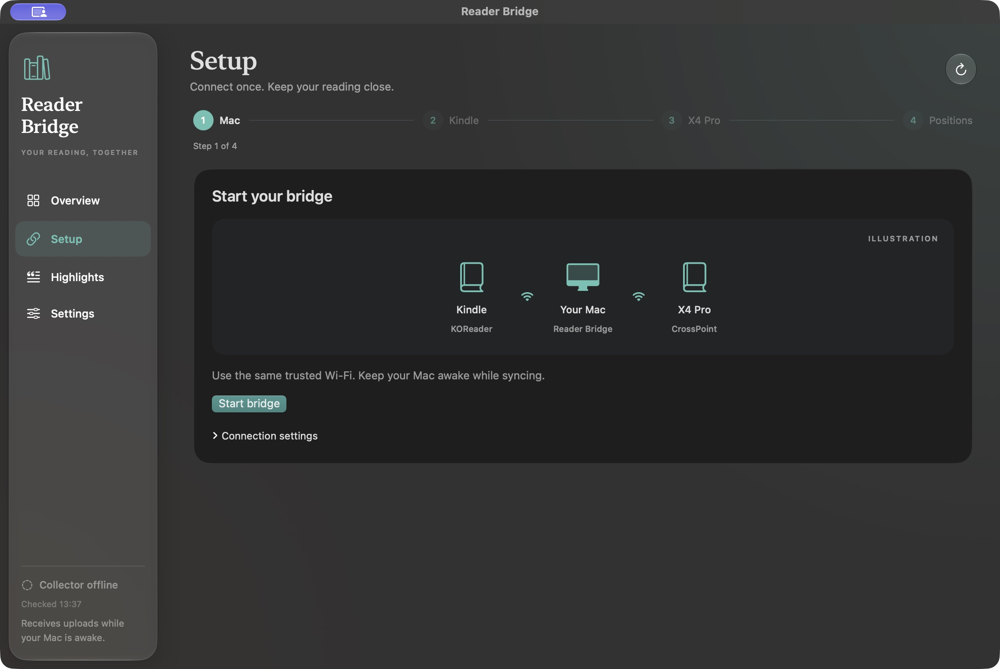

# Reader Bridge for Mac

The native Mac app brings setup, connection status, and the shared highlight archive into one window. It includes its own Python runtime. Basic highlight collection does not require Terminal, Python, Git, GitHub, or a subscription.

Setup shows one step at a time, with device illustrations and extra connection settings under **Connection settings**. Already using Reading Highlights? Choose **Use existing setup** to keep your current reader connections.

This is a **development build**, not a notarized public download. Source builds are available now. A public installer still needs Developer ID signing, Apple notarization, and a clean-Mac/device acceptance pass. Do not describe the development disk image as a finished consumer release.



The app shows one next action. Device guides are labeled illustrations.

## What you need

- macOS 13 or later. Build on Apple Silicon for Apple Silicon; build on Intel for Intel. The first local acceptance run is on Apple Silicon.
- A jailbroken Kindle with working KOReader. Start with the [KindleModding guide](https://kindlemodding.org/jailbreaking/), check your exact model and firmware in [Find My Jailbreak](https://kindlemodding.org/kindle-models), then follow the [KOReader installation guide](https://github.com/koreader/koreader/wiki/Installation-on-Kindle-devices). The Mac app does not jailbreak or downgrade a Kindle.
- An Xteink **X4 Pro** running CrossPoint. Our shared-highlights firmware is required and is built locally from pinned source; Git and the downloaded build tools are needed unless that firmware is already installed. Installing an application firmware update still requires a confirmation on the reader.
- Your readers and awake Mac on the same trusted local network.

## First setup

1. Put **Reader Bridge.app** in Applications before starting its collector. Leave it at that location: the background service runs the interpreter inside the app.
2. Open **Setup**. If it offers **Use existing setup**, select that to connect to your earlier Reading Highlights installation; your readers keep their existing settings. Otherwise follow the Mac step to start the local collector. Ports and the reader address are under **Connection settings**. The app checks for a conflicting port instead of replacing another service. An existing command-line Reader Bridge configuration is preserved.
3. Exit KOReader and connect the Kindle in USB storage mode. Select the detected Kindle or its mounted folder, then install the plugin. Eject and reopen KOReader when prompted.
4. On the X4 Pro, open File Transfer or connect its SD card. Confirm the device model in the app and pair it. The firmware build/staging option is selected by default. Keep it selected unless the Reader Bridge build is already installed, wait for verification, then complete **Settings → System → SD Card Firmware Update** on the reader.
5. Follow the position-sync guide using the same progress account and identical EPUB on both readers. You can choose **Later** and return to Setup when ready. Confirm a round trip only after testing the actual devices. Progress still requires **Upload Local** and **Apply Remote** on Xteink; this app does not change that firmware behavior.
6. Make one highlight on each reader with Wi-Fi connected. Check both appear in **Highlights**. Import an English `My Clippings.txt` to bring your previous Kindle quotes into the same archive.

Setup resumes from saved service and pairing state. A saved pairing is not proof that a disconnected or sleeping reader is currently reachable. The interface distinguishes these conditions.

## Already using Reading Highlights

The app recognizes an earlier installation in `~/Library/Application Support/Reading Highlights` after checking its LaunchAgent, listening process, and authenticated collector response. Choose **Use existing setup** in Overview or Setup. There is no need to change the port or pair your readers again.

This saves a connection in the app's own settings. The original service, credentials, archive, and device settings stay where they are. Highlights, search, import, and export use the existing collector. Its original LaunchAgent continues to manage startup and GitHub backup; the app does not offer stop or backup-reconfiguration controls for that service. Previously configured reading-progress sync and book-library services remain separate.

The archive shows live highlights held in the collector's local inbox. Older quotes that exist only in a GitHub archive are not downloaded automatically. “Highlights received” indicates upload records from a reader, not that the reader is currently online or that reading-progress sync has been tested.

If the original service is offline, the app retains its saved connection and reports it offline. Start the original service and refresh. A changed LaunchAgent or credential must be checked before reconnecting; the app will not trust an arbitrary process on the same port. For an unrelated occupied port on a fresh installation, choose an unused collector port before pairing.

## Everyday use

The menu-bar item reports the collector's status and opens the main window. The collector starts after Mac login once installed and keeps running when you close the window or quit the app. The app's **Open at login** setting controls whether its interface also starts at login. Use the collector's stop action to stop accepting uploads.

Highlights with recorded creation dates appear newest first. Undated highlights follow alphabetically by book, author and passage; an entirely undated archive is labeled **By book · dates unavailable**. Importing old quotes does not make them recent, and the app does not invent their original dates. Equivalent passages retain the earliest known recorded date across sources. Timezone offsets are normalized; dates without a timezone use their recorded wall time as UTC for deterministic ordering.

In **Highlights**, select a quote to read or copy it. Search covers book titles, authors, and quote text. The archive menu beside search contains Kindle-clippings import and JSON export. Use **⌘F** to search, **⌘1–4** to move between sections, and **⌘R** to refresh. Routine status checks run quietly in the background.


Sample archive shown; these screenshots contain no personal highlights or connection details.

The interface follows the Mac's light or dark appearance and accessibility preferences. Builds made with a current Apple SDK use native Liquid Glass controls on macOS 26 and later; older systems use standard materials. Quote-reading surfaces stay opaque for readability.

Highlights remain local by default under `~/Library/Application Support/Reader Bridge`. The app never creates a GitHub repository automatically. GitHub backup is optional under Settings and currently requires the GitHub CLI signed into your account; you must explicitly select your archive and choose whether to create it. Local records remain available when backup is disabled or GitHub is unavailable. Export JSON for a portable copy.

The optional Calibre-Web library uses a Calibre library folder containing `metadata.db`. This advanced step installs Calibre-Web and downloads its dependencies. See [library setup](SETUP.md#5-add-the-home-book-library) for its generated administrator credentials and reader account setup.

The Mac can sleep normally; it will not receive uploads while asleep. Readers keep their offline queues. The app does not change device Wi-Fi or sleep policies. KOReader uploads when already connected; the Xteink firmware manages its own brief upload attempts. Highlight text is collected into one archive; underlines are not mirrored into the other device's book.

## Build the app

Development requires Xcode command line tools and Python 3.12+ on the build machine:

```sh
python3 -m unittest discover -s tests -v
swift test --package-path desktop
python3 scripts/build-macos.py --dmg
```

The build downloads the checksum-pinned Python runtime, compiles SwiftUI, generates the icon, bundles only allowlisted source files, signs the result ad hoc, verifies the signature, and runs the bundled helper against an empty temporary data directory. It writes the app and an architecture-specific disk image to `dist/`. A repeated build requires a fresh `--output` directory so it cannot silently replace a previous app.

For desktop development without packaging:

```sh
READER_BRIDGE_PYTHON="$(command -v python3)" \
READER_BRIDGE_BACKEND="$PWD/desktop.py" \
READER_BRIDGE_APP_DIR="$PWD/.build-cache/development-data" \
swift run --package-path desktop ReaderBridge
```

Use a separate data directory during tests. Do not install test services into an existing real Reader Bridge configuration. Device operations must target disposable fixtures during automated tests; do physical device acceptance separately.

## Public distribution

Build with `--sign-identity 'Developer ID Application: …'` on the matching architecture, then submit the app archive or disk image with Apple's `notarytool`, wait for acceptance, and staple the ticket. Verify Gatekeeper assessment and installation on a clean Mac before publishing. Keep account credentials in the macOS keychain, not in repository files or command logs. This repository does not ship an Apple signing certificate or notarization credential.

Test both upgrade and fresh install, including Mac logout/login, service restart, port conflicts, unavailable network/GitHub, incomplete pairing, queued uploads after reconnecting, and deletion replay. Intel builds and the full physical first-run walkthrough must be independently verified before claiming support.

The app package bundles third-party runtime notices under Resources. Firmware remains a source build until its separate dependency redistribution review is complete.

## Ordering correction in 0.3.1

The ordering fix passed 74 Python tests and 22 Swift tests. Regression coverage includes timezone offsets, fractional seconds, missing/invalid dates, date-preserving deduplication and labels for undated archives. Both dated and undated layouts were checked in an isolated native preview. No stored highlight or deletion data is rewritten by this change.

## Development acceptance on 1 October 2026

The 0.3.0 Apple Silicon development build passed 71 Python tests and 20 native Swift tests, covering pairing prerequisites, staged-firmware acknowledgement, setup recovery, archive selection and background refresh races. Its bundled runtime was exercised with a disposable launchd service: authenticated uploads from both source types, duplicate merging, full-archive search, JSON export, deletion replay, collector restart, stable credentials, and pairing into fake Kindle/SD volumes all passed.

Native visual checks used an isolated preview with sample data: fresh setup, an existing-service candidate, required X4 Pro firmware choices, failed-pairing recovery, staged firmware, optional position setup, keyboard navigation/search, dark-mode contrast and long-quote scrolling. The documented screenshots come from that preview. The full minimum-size, light-appearance, Reduce Transparency and Increase Contrast matrix remains to be checked on supported systems; those paths have code-level fallbacks. Personal reader settings and collector services were not changed by the UI work.

Repeat the packaged acceptance check with the built runtime:

```sh
"dist/Reader Bridge.app/Contents/Resources/runtime/bin/python3" -E -s -B \
  scripts/smoke-macos.py "dist/Reader Bridge.app"
```

It uses random temporary service labels and an unused port, and unloads those jobs on exit. This checks launchd restart, not an actual logout/login or reboot. Public notarization, Intel execution, clean-Mac installation, login-item approval, and the complete setup on physical devices remain unverified for this app build. The previously tested reader firmware/plugin behavior is not a substitute for those app acceptance checks.
